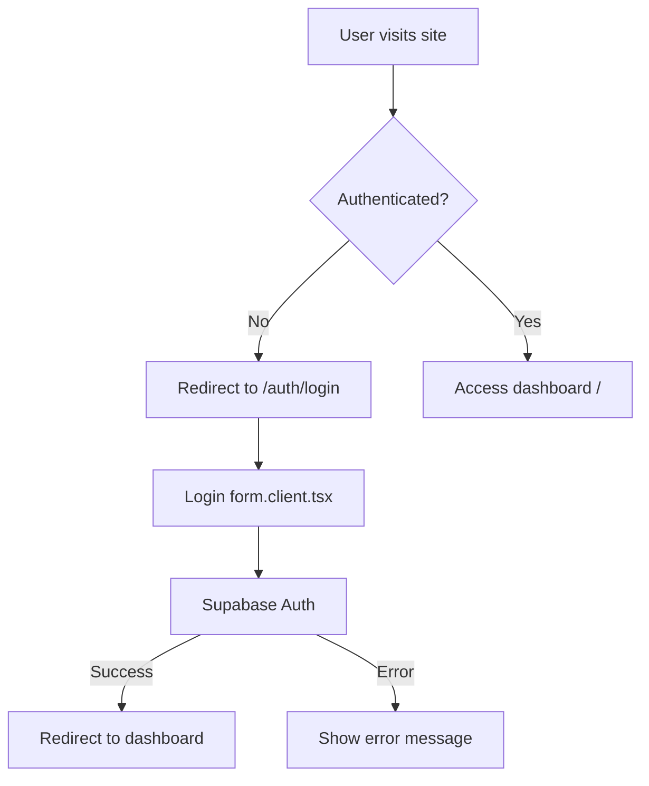
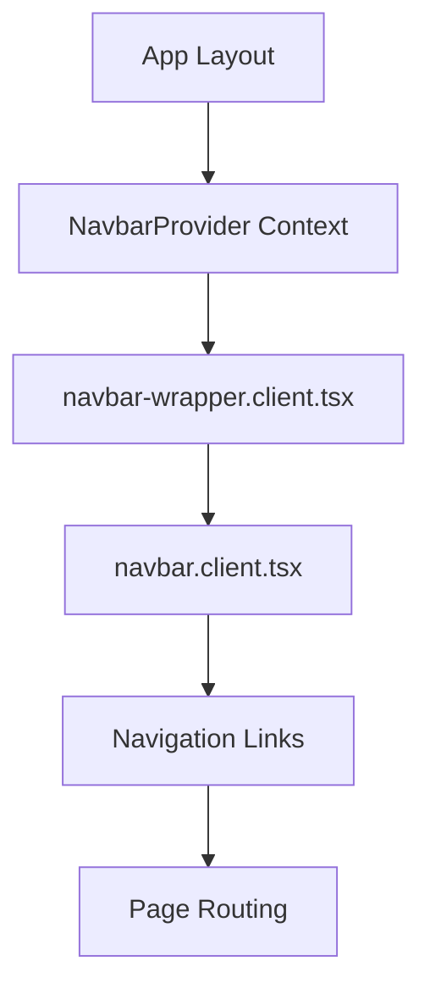
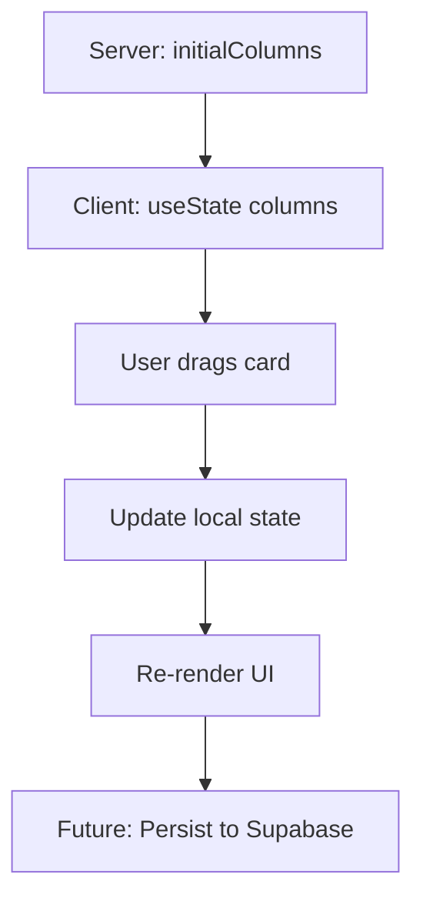
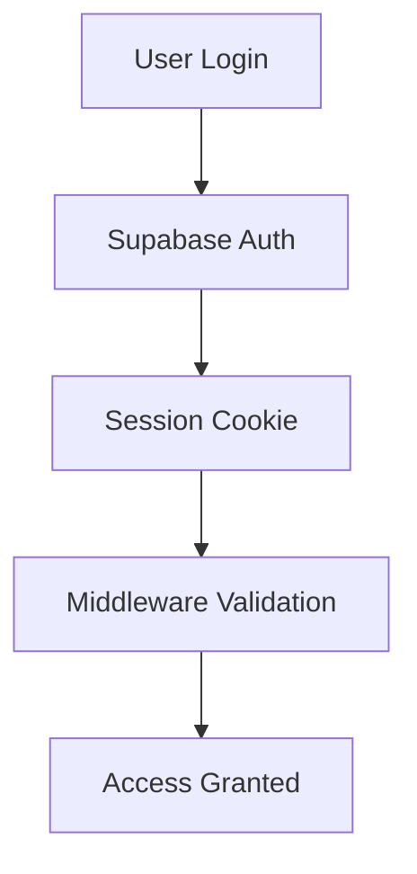

# Simple Ink Studios - Application Architecture

## 🏗️ How The App Works

This document explains the complete architecture and data flow of the Simple Ink Studios management platform.

## 🧩 Component Architecture Overview

### File Naming Convention

All components follow a clear naming pattern to indicate their execution environment:

- **`.client.tsx`** - Components that run in the browser with interactive features
- **`.server.tsx`** - Components that run on the server for data fetching and SEO
- **No suffix** - Utility components, types, or components that can run in both environments

### Component Categories

```
components/
├── auth/                    # Authentication forms and logic
│   ├── login-form.tsx       # Client: Interactive login form
│   ├── signup-form.tsx      # Client: Interactive signup form
│   └── auth-button.tsx      # Server: Static auth button
├── studio/                  # Core business logic components
│   ├── pipeline/            # Client pipeline management
│   │   ├── PipelineBoard.client.tsx     # Main interactive pipeline
│   │   ├── PipelineColumns.client.tsx   # Column containers
│   │   └── DraggableCard.client.tsx     # Individual client cards
│   ├── Calendar.client.tsx  # Interactive calendar
│   ├── CheckList.client.tsx # Task management
│   └── Card.server.tsx      # Static card components
├── layout/                  # Navigation and page layout
│   ├── navbar/              # Navigation components
│   │   ├── navbar.client.tsx         # Interactive sidebar
│   │   └── navbar-wrapper.client.tsx # Navigation state wrapper
│   ├── PipelineBoard.server.tsx      # Server-side data provider
│   └── Container.server.tsx          # Page layout wrapper
└── ui/                      # Reusable UI components
    ├── button.tsx           # Button variants
    ├── input.tsx            # Form inputs
    └── card.tsx             # Card layouts
```

## 🔄 Application Flow

### 1. Authentication Flow



**Key Files:**
- `middleware.ts` - Protects routes and checks authentication
- `components/auth/login-form.tsx` - Handles user input and login logic
- `lib/supabase/client.ts` - Manages Supabase authentication

### 2. Navigation Flow



**How Navigation Works:**
1. **Context State**: `NavbarProvider` manages sidebar expansion state globally
2. **Path Detection**: `navbar-wrapper.client.tsx` uses `usePathname()` to highlight active page
3. **Interactive Sidebar**: `navbar.client.tsx` handles expand/collapse and navigation
4. **Responsive Layout**: All pages adjust margin based on navbar state

### 3. Pipeline Management Flow

```mermaid
graph TD
    A[/content/pipeline page] --> B[PipelineBoard.server.tsx]
    B --> C[Fetch initial data]
    C --> D[Pass to PipelineBoard.client.tsx]
    D --> E[Interactive drag & drop]
    E --> F[Update local state]
    F --> G[Future: Sync to Supabase]
```

**Data Flow Breakdown:**
1. **Server Component** (`PipelineBoard.server.tsx`):
   - Fetches initial pipeline data (currently from mock data)
   - Handles authentication and data validation
   - Passes clean data to client component

2. **Client Component** (`PipelineBoard.client.tsx`):
   - Receives initial data as props
   - Manages local state for drag & drop interactions
   - Handles real-time UI updates
   - Uses @dnd-kit for drag and drop functionality

3. **Column Management** (`PipelineColumns.client.tsx`):
   - Renders individual pipeline columns
   - Each column is a droppable target
   - Manages sortable context for clients within columns

4. **Client Cards** (`DraggableCard.client.tsx`):
   - Individual client information cards
   - Draggable between columns
   - Shows client name, contact, and assigned artist

## 🗂️ Data Management

### Current Implementation

```typescript
// Mock data structure (lib/mock-data.ts)
const initialColumns: Column[] = [
  {
    id: "leads",
    title: "New Leads",
    clients: [
      { id: "1", name: "Alice Johnson", contact: "alice@email.com" }
    ]
  }
];
```

### State Flow



**State Management:**
- **Server State**: Initial data from Supabase (future)
- **Client State**: React useState for real-time interactions
- **Context State**: Global UI state (navbar, themes)

## 🛡️ Security & Authentication

### Middleware Protection

```typescript
// middleware.ts - Runs on every request
export async function middleware(request: NextRequest) {
  return await updateSession(request);
}
```

**Protected Routes:**
- `/` (dashboard)
- `/content/*` (all features)
- `/settings`

**Public Routes:**
- `/auth/*` (login, signup)
- Static assets

### Supabase Integration



## 📱 Responsive Design

### Layout System

```css
/* App uses flex layout */
.app-canvas {
  display: flex;
}

/* Navbar width affects content */
.content-area {
  margin-left: isNavbarExpanded ? 256px : 80px;
}
```

**Responsive Behavior:**
- **Desktop**: Sidebar always visible, content adjusts margin
- **Mobile**: Sidebar overlay, body scroll locked when open
- **Context**: `useNavbar()` hook provides state to all components

## 🔮 Future Enhancements

### Database Integration
- Replace mock data with Supabase queries
- Real-time collaboration with Supabase subscriptions
- Client data persistence and sync

### Pipeline Features
- Custom pipeline stages
- Client detail editing
- Automated workflow triggers
- Analytics and reporting

### Communication Tools
- Email integration
- SMS notifications
- Calendar scheduling
- File attachments

## 🧰 Key Libraries

- **Next.js 15**: App Router, Server/Client Components
- **Supabase**: Authentication and database
- **@dnd-kit**: Drag and drop functionality
- **TailwindCSS**: Styling and responsive design
- **TypeScript**: Type safety and developer experience

## 📁 File Structure Summary

```
/
├── app/                     # Next.js App Router
│   ├── auth/               # Authentication pages
│   ├── content/            # Main app features
│   ├── layout.tsx          # Root layout with navbar
│   └── page.tsx            # Dashboard home
├── components/             # React components (organized by function)
├── lib/                    # Utilities and configuration
│   ├── supabase/          # Authentication setup
│   ├── contexts/          # React contexts
│   ├── types.ts           # TypeScript definitions
│   └── mock-data.ts       # Development data
└── middleware.ts           # Route protection
```

This architecture provides a clean separation between server-side data fetching and client-side interactions, making the app both performant and maintainable.